# 👋🏼 Hi there!

[My Blog](https://rvnnt.dev)

I am an open-source developer working on projects related to FastAPI, Svelte, Spring, Docker, Nginx, and Github Actions.

Life never ends......just like this torus that spins forever.

💻 Developer | 🎨 ASCII Art Enthusiast | 🚀 Code Explorer

## Currently working on:

## Skills:

## Stats:

<!--
**revenantonthemission/revenantonthemission** is a ✨ _special_ ✨ repository because its `README.md` (this file) appears on your GitHub profile.
-->